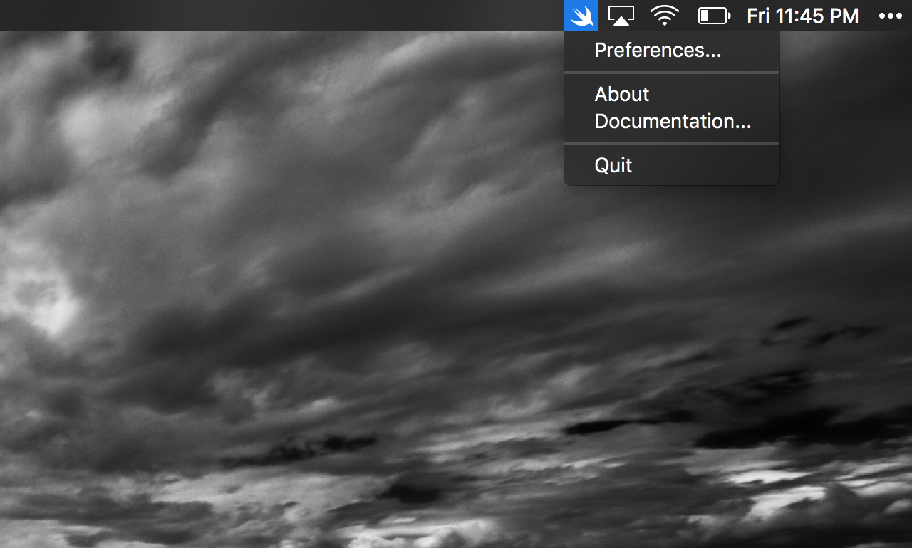
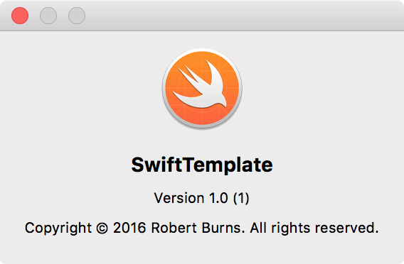
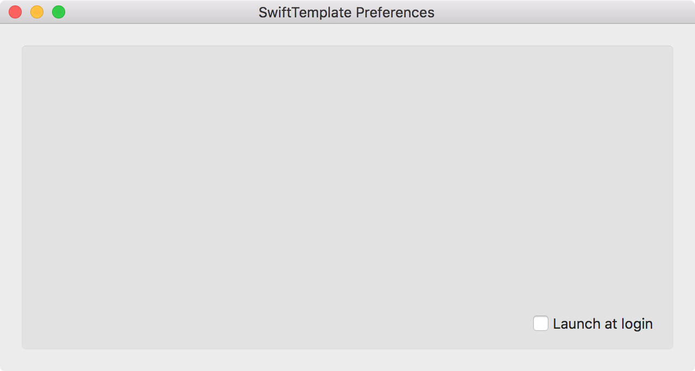

# SwiftTemplate

## Overview

**SwiftTemplate** is a MacOS application written in Swift.  This template application provides the following features:

- Status menu
- About window
- Preferences window
- Launcher Application to autostart the application on login (Preference)

## Screenshots

Status Menu



About Window



Preferences Window



## Customizing

Replace the instance of "NewSwiftProject" in the first command below with your desired project name.

```sh
$ export newProjectName="NewSwiftProject"
$ git clone https://github.com/burnsra/SwiftTemplate.git "$newProjectName"
$ cd "$newProjectName"
$ git mv SwiftTemplate "$newProjectName"
$ git mv SwiftTemplateLauncher "$newProjectName"Launcher
$ git mv SwiftTemplate.xcodeproj "$newProjectName".xcodeproj
$ find README.md "$newProjectName" "$newProjectName"Launcher "$newProjectName".xcodeproj -path '*Assets.xcassets*' -prune -o -type f -print0 | xargs -0 sed -i '' 's/SwiftTemplate/$newProjectName/g'
$ git add -A
$ git commit -m "Renamed template project to "$newProjectName
```

## Contributions

Do you want to improve the app or add any useful features? Please go ahead and create pull requests. I'm thankful for any help.

## License

[MIT](https://github.com/burnsra/SwiftTemplate/blob/master/LICENSE) © Robert Burns
